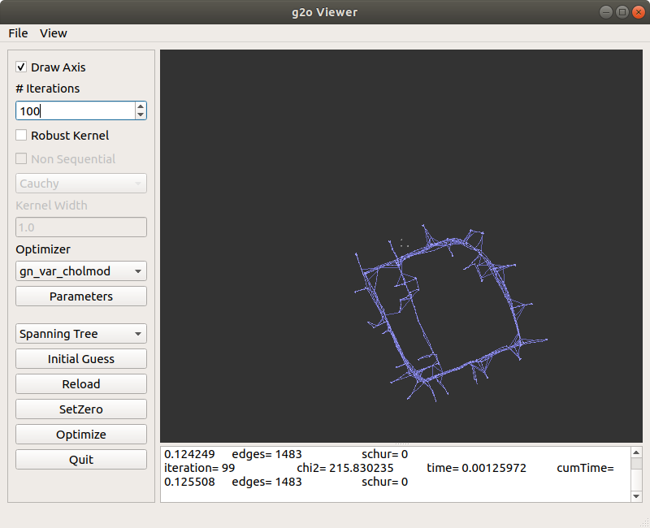

# Pose-Graph-Optimisation
Mobile Robotics M'21 Project 1

# Question 1:  Pose Graph Optimization for 1D SLAM

A solved example for 1D SLAM which optimizes for pose variables using weighted least squares method (Gauss Newton) has been explained in the class. You can view it at `examples/1D-SLAM.ipynb`. Your first task is to code this from scratch.

For this section, you have to calculate Jacobian analytically yourself and use it. However, you can check how correct it is using `jax`'s `jacobian`. Its usage is explained in the supplementary notebook (`examples/`).

#### How to get started?

1. Go through the example and understand the optimization procedure.
2. Generate the data as in the example.
3. Write the derivatives of the function with respect to the constraints
4. Create the final jacobian and write the update steps using Gauss Newton
___
# Question 2:  Pose Graph Optimization for 2D SLAM

### Objective
A robot is travelling in a oval trajectory. It is equipped with wheel odometry for odometry information and RGBD sensors for loop closure information. Due to noise in wheel odometry it generates a noisy estimate of the trajectory. Our task is to use loop closure pairs to correct the drift.

We pose this problem as a graph optimization problem. In our graph, poses are the vertices and constraints are the edges. 

### Given: 
In practical scenarios, we'd obtain the following from our sensors after some post-processing:

1. Initial position
2. Odometry Contraints/Edges: This "edge" information tells us relative transformation between two nodes. These two nodes are consecutive in the case of Odometry but not in the case of Loop Closure (next point).
3. Loop Closure Contraints/Edges: Remember that while optimizing, you have another kind of "anchor" edge as you've seen in 1. solved example.

You have been given a text file named `edges.txt` (in `data/`) which has all the above 3 and it follows G2O's format (as explained in class, [link here](https://saishubodh.notion.site/G2O-Edge-Types-d9f9ff63c77c4ceeb84b1e49085004e3) ). The ground truth is `gt.txt`.

#### Part 1

Using the following motion model, you have to first generate the "initialization" for all the poses/vertices using the "Given" information. Just like in the 1D case.
$$x_{k+1} = x_{k} + \Delta x_{(k,k+1)} \cos(\theta_k) - \Delta y_{(k,k+1)} \sin(\theta_k) \\
y_{k+1} = y_{k} + \Delta y_{(k,k+1)} \cos(\theta_k) + \Delta x_{(k,k+1)} \sin(\theta_k) \\
\theta_{k+1} = \theta_{k}+  \Delta \theta_{(k,k+1)} \tag{3}$$

Even the loop closure nodes are related by the above model, except that it need not necessarily be consecutive notes k and k+1.

Save this initial trajectory as `edges-poses.g2o`.

If you plot the initialized poses using odometry information, you need to get as the right plot below (this is the "noisy trajectory"): (Left one is the ground truth)

(Use `draw()` helper function or `g2o_viewer` or `EVO`)

##### Produced Output:

***

#### Part 2

Now calculate the residual and the Jacobian and update your parameters using LM.

Use LM algorithm. Regarding Jacobian calculation, you can use `jax`'s `jacobian` as part of your main code. However, you still have to separately calculate it analytically and verify if it matches with `jax`'s `jacobian` using frobenius norm `frobNorm()`). Calculation and verification is compulsory, but it is your choice to use whichever as part of your optimization. Use whichever is faster. You can also visualise your Jacobian and see the structure of the matrix (just use `plt.imshow`).

**Regarding LM iterations, stopping criterion, information matrix values.**

1. As your iterations proceed, you have to print relevant information (iteration number and error value: [$F = \frac{1}{2}  \mathbf{f}^{\top} \mathbf{\Omega} \mathbf{f} $ (notes on non-linear LS)](https://saishubodh.notion.site/From-linear-algebra-to-non-linear-weighted-least-squares-optimization-13cf17d318be4d45bb8577c4d3ea4a02#32832dee7d6c4ab49581463d9b784f21) at every step).

2. You have to show the plots (ground truth, noisy & optimized: all 3 in a single plot) at every 10 steps or so.

3. You could start with information values of 500 for odom edges, 700 for loop closure edges, 1000 for anchor edge (same for all dimensions). However, you have to _heavily_ experiment with these values. (Given that you somehow know loop closure information is way more reliable than odometry.). At the end of your experimentation, your error $F = \frac{1}{2}  \mathbf{f}^{\top} \mathbf{\Omega} \mathbf{f} $ should by < 40. Explain your experimentation in detail using tables/plots etc if necessary.
    
Do not worry if you're not getting a perfect trajectory. Our parametrization was oversimplified for the sake of this project. With that being said, it is possible to get the error down to < 40 and make it at least look like an oval shaped trajectory, even if it doesn't perfectly resemble the ground truth. However, using `g2o` (seen later on), you will be getting a close to ground truth trajectory.

***
#### Part 3
- Write about the residuals you computed, its structure and shape. Also explain the structure of the Jacobian and its shape (Express the shape in terms of the number of vertices, loop constraints, and such, not exact numbers). 
- Write about the optimization process and any observations using intermediate plots and such. 

##### Residuals
let p be number of odometry edges

let q be number of loop constraint edges, let each edge connect from vertex l\[i\] to l\[i+1\] where i ranges from 0 to q-1

let the fixed vertex have x,y,theta values a,b,c

$f = \begin{bmatrix}
    x_{0} + \Delta x_{(0,1)} \cos(\theta_0) - \Delta y_{(0,1)} \sin(\theta_0) - x_{1}\\
    y_{0} + \Delta y_{(0,1)} \cos(\theta_0) + \Delta x_{(0,1)} \sin(\theta_0) - y_{1}  \\
    \theta_{0}+  \Delta \theta_{(0,1)} -  \theta_{1} \\
    \vdots \\
    x_{p-1} + \Delta x_{(p-1,p)} \cos(\theta_{p-1}) - \Delta y_{(p-1,p)} \sin(\theta_{p-1}) - x_{p}\\
    y_{p-1} + \Delta y_{(p-1,p)} \cos(\theta_{p-1}) + \Delta x_{(p-1,p)} \sin(\theta_{p-1}) - y_{p}  \\
    \theta_{p-1}+  \Delta \theta_{(p-1,p)} -  \theta_{p} \\
x_{l[0]}+\Delta x_{(l[0],l[1])}\cos(\theta_{l[0]})-\Delta y_{(l[0],l[1])}\sin(\theta_{l[0]})-x_{l[1]}\\
y_{l[0]}+\Delta y_{(l[0],l[1])}\cos(\theta_{l[0]})+\Delta x_{(l[0],l[1])}\sin(\theta_{l[0]})-y_{l[1]}\\
    \theta_{l[0]}+  \Delta \theta_{(l[0],l[1])} -  \theta_{l[1]} \\
    \vdots \\
x_{l[q-1]}+\Delta x_{(l[q-1],l[q])}\cos(\theta_{l[q-1]})-\Delta y_{(l[q-1],l[q])} \sin(\theta_{l[q-1]}) - x_{l[q]}\\
    y_{l[q-1]} + \Delta y_{(l[q-1],l[q])} \cos(\theta_{l[q-1]}) + \Delta x_{(l[q-1],l[q])} \sin(\theta_{l[q-1]}) - y_{l[q]}  \\
    \theta_{l[q-1]}+  \Delta \theta_{(l[q-1],l[q])} -  \theta_{l[q]} \\
    x_{0}  - a\\
    y_{0} - b  \\
    \theta_{0} -  c \\
    \end{bmatrix}$
    
shape of residual = (3 * number of odometry edges + 3 * number of loop constraint edges + 3) X 1

shape of residual = (3p + 3q + 3) X 1

ie. we have x,y,theta elements for each of the edges as well as 3 for fixing the first vertex (ie vertex 0)

#### Jacobian
let v be number of vertices, p be number of odometry edges, q be number of loop constraint edges
$J = \begin{bmatrix}
    \frac{\partial f}{\partial x_{0}} \frac{\partial f}{\partial y_{0}} \frac{\partial f}{\partial \theta_{0}} \dots \frac{\partial f}{\partial x_{v}} \frac{\partial f}{\partial y_{v}} \frac{\partial f}{\partial \theta_{v}}\\
    \end{bmatrix}$

We know f is (3p + 3q +3) X 1. Hence from the above structure of J we can see that, for v vertices, the shape of J is

Shape of jacobian = (3p + 3q + 3) X v

#### Observations
- The optimization got to a reduced error fast and then only slight reductions were seen. 
- giving more weightage to loop constraint and anchor (through higher information value) gives lesser error, however the poses look less natural and some steps between adjacent poses become huge.
- Reducing weightage of odometry gives lesser error because odometry measurements generally has higher error than loop closure contraints
- different information matrices were tried with higher weightage for odometry. However they didn't reduce error past a certain level
- 
- 

***
#### Part 4
Write the final optimised trajectory as a g2o file. You can do this alongside any of the earlier parts.

- 

***

# Question 3: Trajectory Evaluation and g2o

#### Evo
We need a measure of how good the trajectory is. The error/loss used earlier doesn't tell us much about how the trajectory differs from the ground truth. Here, we try to do just this - compute error metrics. Rather than computing these from scratch, we will just Evo - https://github.com/MichaelGrupp/evo/.

Look at the absolute pose error (APE) and relative pose error (RPE). What do they capture and how are they calculated (descriptive answer)? How do these metrics differ in methodology? Can we determine if the error is more along the x/y axis?

Answer the above questions and report errors for the obtained trajectory.

<table><tr>
<td>  </td>
<td>  </td>
</tr></table>
<table><tr>
<td>  </td>
<td>  </td>
</tr></table>
<table><tr>
<td>  </td></tr><tr>
<td>  </td></tr><tr>
<td>  </td>
</tr></table>

#### Observations:
1. APE refers to the Absolute Pose Error which refers to the absolute error in the trajectory. The respective corresponding poses of the reference and the estimated trajcetory are compared with. This is repeaed for the entire trajectory and can be seen in the graph as well. It roughly captures the absolute differences which is why the right-side part of the graph that is at a higher distance is having more error thereby giving a global picture of comparison. 
2. RPE refers to the Relative Pose Error wgich as the name suggests, captures the relative pose errors i.e motion and drift. We can also identify the rotational and translational drift using --pose-relation 
Yes we can say if error is more along x or y axis based on visual observation of the x,y axis trajectory generated.

### g2o
Install g2o as mentioned in `examples/g2o.ipynb` and optimise `edges.txt`, the file you used earlier. Also use `g2o_viewer` and optimize `intel` (a trajectory in the Intel research lab) and `sphere`. They should look something like:

<table><tr>
<td>  </td>
<td>  </td>
</tr></table>

#### Answers:
##### Optimising Edges
<table><tr>
<td>  </td>
<td>  </td>
<td> </td></td>
</tr></table>
<table><tr>
<td>  </td>
<td>  </td>
<td>  </td>
</tr></table>

##### Optimising Intel
<!-- 

 -->
<table><tr>
<td>  </td>
<td>  </td>
</tr></table>
<table><tr>
<td>  </td>
<td>  </td>
<td>  </td>
</tr></table>

##### Optimising Sphere

<!-- 

 -->
<table><tr>
<td>  

 </td>
</tr></table>

#### Observations
The optimisations were done with different optimisers such as LM, GD for different iterations and also by adding Cauchy and Hober kernels. Based on the number optimisers, kernel choices used, we get different number of iterations needed for error to converge and achieve best output. "Best method" is also identified based on considering both iterations and min.Error at the end.
Best method used for fastest and least error output:
1. noisy edge file: lm_fix_3_2_mod with 70 iterations
2. intel.g2o file: lm_fix_3_2_mod with 600 iterations along with a Cauchy Robust Kernel
3. sphere.g2o file: lm_fix_6_3_mod with 600 iterations